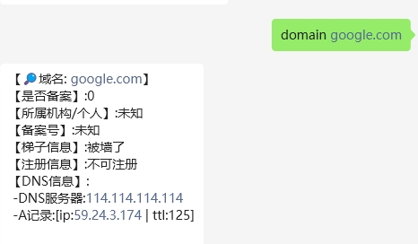

# 域名查询

#### 介绍
chatgpt-on-wechat-plugins插件开发



### 环境安装

```cmd
pip install -r requirements.txt
```

### 版本更新

- V1.0：域名基本信息、地区、机构查询
- V1.1：新增域名是否需要翻墙
- V1.2：新增域名是否可以注册
- V1.3：新增域名解析记录，更名"域名查询"
- V1.4: 模块分割