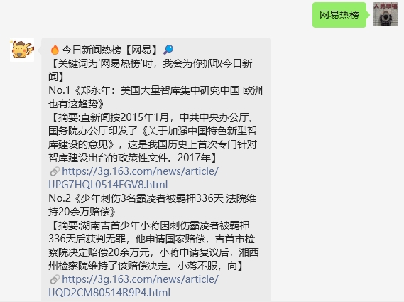

# 网易热榜查询

#### 介绍
chatgpt-on-wechat-plugins插件开发

## 配置

需要在config.json和config.py上新建参数

```python
token = conf().get("tophub_token")  # 从配置文件中获取 tophub_token
news_type = conf().get("tophub_type") # 从配置文件中获取 tophub_type
```


### 更新说明

- V1.0 ：实现基本网易热榜功能
- V1.1：修改关键词，插件更名`TopHub163`
